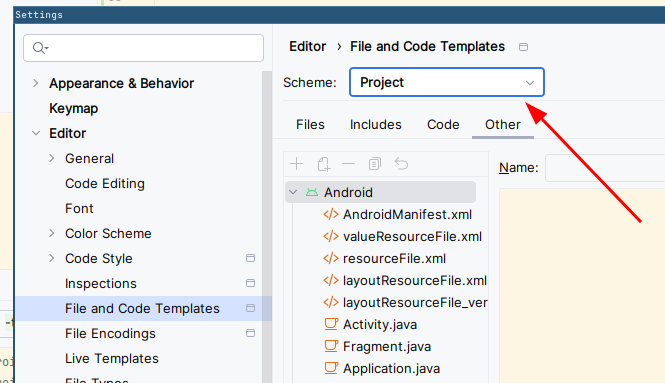
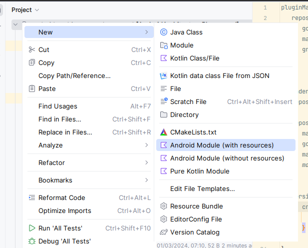

# microPebble

A small scrappy open source Pebble companion app, based on the [libpebble3](https://github.com/coredevices/libpebble3).
It's not meant as a grand replacement for the original app, but as a small app with the functional UI and the
features that I care about.

Supported features:

* Connecting to the watches
* Installing / uninstalling watch apps via PBW
* PebbleKit JS (including configuration pages)
* Basic notification config
* Music control
* Calendar sync
* PebbleKit Android (for Notification Center, Music Boss etc.),
  albeit it's slower on the Pre-P2 watches
* Developer connection
* Voice recognition (on Android 13+)
* Calendar filtering
* Watch menu reordering
* Firmware update (from pbz files)
* Firmware update from recovery mode

  

# Install

[](https://apps.obtainium.imranr.dev/redirect?r=obtainium://add/https://github.com/matejdro/microPebble)
[](../../releases/latest)

# Contributing

To contribute to this project:

1. Install [Git LFS](https://git-lfs.com/)
2. Checkout `main`
3. Pull submodules `git submodule update --init --recursive`
4. Run `git lfs fetch` in the repo
5. Create a new branch for your contribution
6. Commit your work. While commiting, use [conventional commits](https://www.conventionalcommits.org/en/v1.0.0/). Scope tag should
   be the name of the module you are updating.
7. Try to avoid breaking changes, but if they cannot be avoided, you must put `BREAKING CHANGE` in the footer of the commit
   mesasage
   and explain the change.
8. Create a merge request
9. After your PR is merged, new release will be generated automatically every day

## libpebble3 changes

This app uses libpebble3 version from the
[micropebble branch of the matejdro/libpebble fork](https://github.com/matejdro/libpebble3/tree/micropebble).

If your changes need changes to the libpebble:

1. Make the PR for the [matejdro/libpebble](https://github.com/matejdro/libpebble3) first
2. Consider also upstreaming all your changes to the  [original libpebble repo](https://github.com/coredevices/libpebble3) -
   ideally we shouldn't stray too far from them
2. Once those are merged, make the PR on this repo

## Updating versions

Process for updating all library versions::

1. Update Gradle version
    1. Find latest version and the checksum for -all version from https://gradle.org/release-checksums/
       (We use SHA to secure against wrapper attack, see https://blog.gradle.org/wrapper-attack-report)
    2. Run `./gradlew wrapper --gradle-version VERSION --gradle-distribution-sha256-sum SHA`, where you
       substitute `VERSION` and `SHA` with the info found in the previous step.
2. Open `libs.toml` file and check if any versions marked with `@pin` have been unblocked and can now be updated
3. Run `./gradlew versionCatalogUpdate`.
4. Sync the project, build the app and run all tests to make sure everything still works.
5. Run `detektDebug` gradle task to find any new deprecated code
6. For any new deprecated code found by the search:
    * If the fix is trivial, fix it immediately as part of the update commit
    * Otherwise, make a tech debt ticket and add a @Suppress with the ticket number
      (and/or discuss with the team how to address it)

## Creating a new module

To easily add new modules, first enable project templates (you only need to do this once).
Open Android Studio's Settings, go to "File and Code Templates" and set Scheme to "Project".



Then, to create a new module:

1. Right click on the root in the project window, select New and then the project type you want
   
2. Add module to `settings.gradle.kts`
3. Add module to app's `build.gradle.kts` as `implementation(projects.newModule)`)
4. Remove leading space from all generated ` .gitignore` files (workaround for the https://youtrack.jetbrains.com/issue/IJPL-2568)

## Hierarchy of the feature modules

Every feature should contain following modules:

* `feature-name`
    * `data` - data module with all non-UI logic (such as repositories).
      No other `data` or `ui` module should depend on this (except for tests).
    * `api` - interfaces and data models exposed to other modules.
      This module should generally contain no logic to speed up builds.
    * `ui` - Module containing feature's ui (Screens / Fragments / ViewModels).
      No other `data` or `ui` module should depend on this (except for tests).
    * `test` (optional) - Module containing test helpers for faking stuff exposed in the `api` module

If your module contains instrumented tests, you must enable them with the following call:

```kotlin
custom {
   enableEmulatorTests.set(true)
}
```

## Creating screenshot tests

To create screenshot tests for your compose screen:

1. Make preview functions public
2. Add `showkase` plugin to the module of the screen you want to test
2. Add `@ShowkaseComposable(group = "Test")` annotation to the preview of the screen you want to test
3. run `recordPaparazziDebug` gradle task to record golden screenshot
   (double check that only previews for your screen were generated)

# Attribution

App icon is [watch-variant by the GreenTurtwig](https://pictogrammers.com/library/mdi/icon/watch-variant/).
